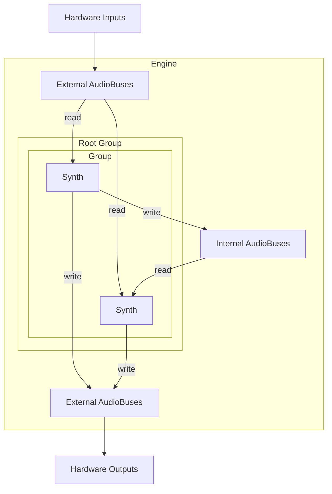
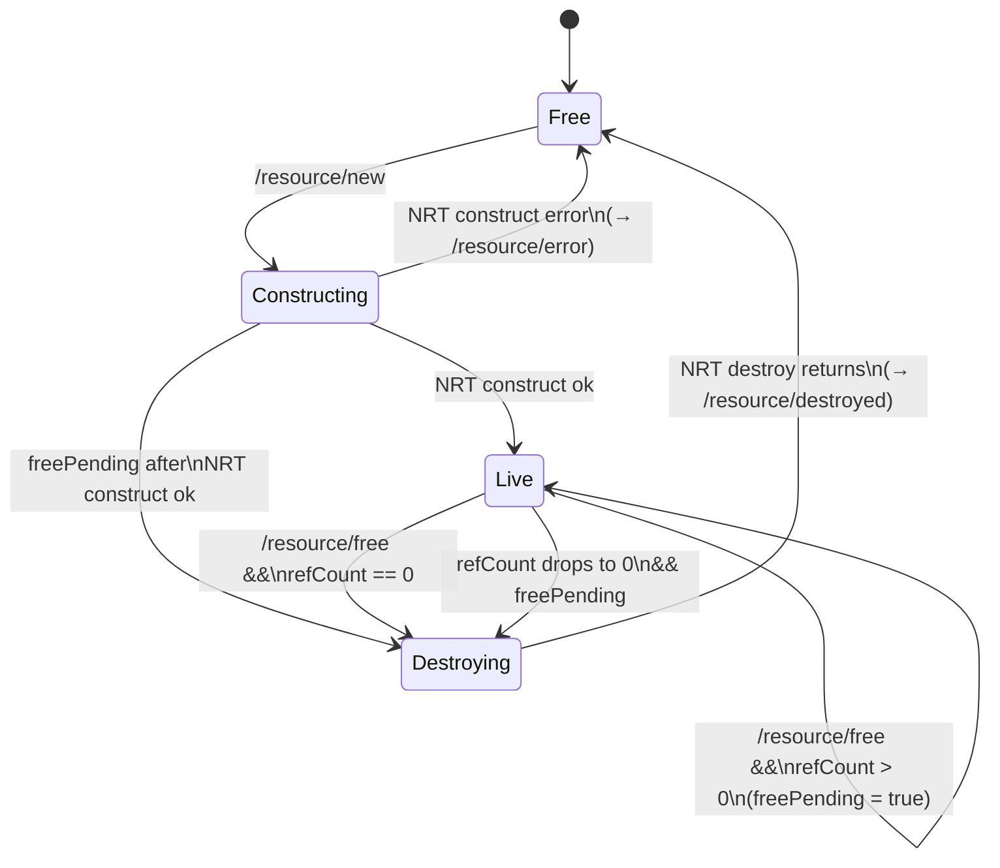

# Architecture

## Audio routing

- **External AudioBuses** map to hardware I/O channels (input or output).
- **Internal AudioBuses** route audio between Synths within the Engine.
- The **Root Group** is the top of the node tree. Groups nest arbitrarily; Synths are leaves.
- Each Synth maps its audio inputs and outputs to buses via `/synth/map/input` and `/synth/map/output` (see [`osc-api.md`](osc-api.md)).

## Resource system

The Engine owns a fixed-size pool of typed, reference-counted Resource slots, indexed by a client-assigned `Methcla_ResourceId`. Capacity is set at startup via `EngineOptions::maxNumResources` (default 256). A Resource is a Plugin-allocated object — its layout is declared in a Plugin-supplied header and identified by a URI — that can be shared between the RT and NRT contexts and across Synths.

### Resource state machine

Each slot is in one of four states; all transitions run on the RT thread.

`freePending` records that `/resource/free` arrived while the slot was Constructing or Live-with-refCount>0. The state stays Live until the last `resource_release` drains the refcount; that release then transitions the slot to Destroying and schedules the NRT destroy.

### Acquire / release and refcount

`resource_acquire(world, id, expected_uri)` on `Methcla_World`:

1. Bounds-check `id`; require the slot to be Live.
2. Compare the slot's URI to `expected_uri` (string equality); reject on mismatch.
3. Increment `refCount` and return the resource's data pointer.

`resource_release(world, id)` decrements `refCount`. If the count reaches zero and `freePending` is set, the slot transitions Live → Destroying and an NRT destroy is scheduled.

Both primitives mutate state from the RT thread only; no atomics are required.

### NRT access

`perform_with_resources(world, ids, num_ids, perform, user_data)` brackets a worker-thread callback with RT-side acquire/release of the listed Resources. The engine acquires each id on RT, dispatches the callback to a worker thread with the array of data pointers, and releases the Resources back on RT after the callback returns. The pointers are valid only for the duration of the callback. If any acquire fails the already-acquired Resources are released and the callback is not invoked.

### Mutability

`Methcla_ResourceMutability` (`kMethcla_Mutable` / `kMethcla_Immutable`) is informational metadata declared by the Resource type. The Engine does not enforce read/write access; the Resource class's contract documents it for consumers and Plugin authors.

### Threading summary

| Event                             | Thread   | Touches                                                                       |
| --------------------------------- | -------- | ----------------------------------------------------------------------------- |
| `/resource/new` arrives           | RT       | slot Free → Constructing; schedule NRT construct                              |
| NRT construct returns             | NRT → RT | RT: slot → Live; emit `/resource/ready` (or Free + `/resource/error`)         |
| `resource_acquire`                | RT       | `refCount++`                                                                  |
| `resource_release`                | RT       | `refCount--`; if 0 && freePending: → Destroying + schedule destroy            |
| `/resource/free` arrives          | RT       | refCount==0 && Live: → Destroying + schedule destroy; else `freePending=true` |
| `perform_with_resources` dispatch | RT       | acquire all; schedule NRT callback                                            |
| NRT callback returns              | NRT → RT | RT auto-releases all                                                          |
| NRT destroy returns               | NRT → RT | RT: slot → Free; emit `/resource/destroyed`                                   |

Lifecycle notifications (`/resource/ready`, `/resource/error`, `/resource/destroyed`) originate from RT after the state transition and are dispatched via NRT — mirrors `/node/done`. Sending notifications directly from NRT would let a client's follow-up `/synth/new` race the publish.

### Multi-worker caveat

Resource-def callbacks (`construct`, `destroy`, and the `perform_with_resources` callback) run on the worker pool and **can execute concurrently across different worker threads** for different Resources. The engine's NRT-side APIs are thread-safe, but Plugin authors that share state across Resource instances must synchronize that state themselves.
