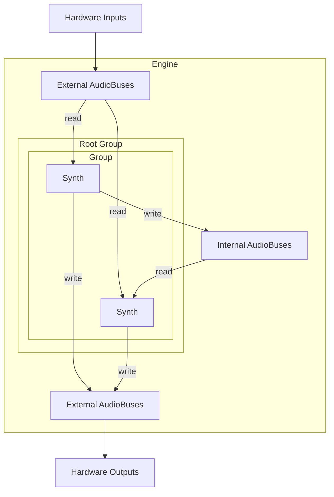

# Architecture

## Audio routing



- **External AudioBuses** map to hardware I/O channels (input or output).
- **Internal AudioBuses** route audio between Synths within the Engine.
- The **Root Group** is the top of the node tree. Groups nest arbitrarily; Synths are leaves.
- Each Synth maps its audio inputs and outputs to buses via `/synth/map/input` and `/synth/map/output` (see [`osc-api.md`](osc-api.md)).
```
